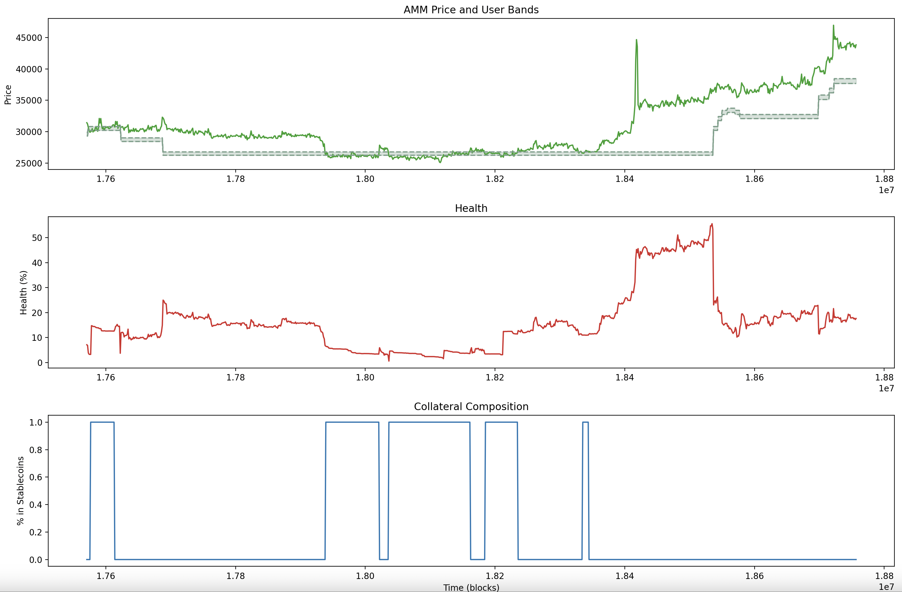

# Lesson 3: Scrape Framework

## [🎥 crvUSD Ape Tutorial Video 3 : Scrape Framework 🎬](https://youtu.be/DNW4G43U9II)

This lesson focuses on using ape for data analysis by scraping historical data.  Being Pythonic, ape is a nice glue layer between blockchain data and Python's many advanced data science libraries.  Unfortunately, scraping blockchain data can be quite slow.  The sample script includes some helpful features like a TEST_MODE toggle to preview results and caching output data.

The lesson demonstrates scraping by pulling user data for a sample $crvUSD loan in the WBTC market.  The final graphic includes three graphs of $crvUSD loan properties for a sample loan.

The chart shows:

 * **GREEN** A solid line showing the price showing the history of the WBTC price pulled from the market's [AMM Contract](https://etherscan.io/address/0xe0438eb3703bf871e31ce639bd351109c88666ea#readContract), compared with a shaded range showing the user's liquidation price.
 * **RED** The user's corresponding loan health history as measured by the market's [Controller Contract](https://etherscan.io/address/0x4e59541306910ad6dc1dac0ac9dfb29bd9f15c67).
 * **BLUE** The user's percentage of collateral which has been converted to stablecoins, as opposed to its original WBTC collateral.

The script comes in two different versions, an [unfinished version](src/scripts/crvusd_health.py) you can use to live code along with the video, and a [finished version](src/scripts/crvusd_health_final.py) you can run directly out of the box.  We also include a [diff file](solution.diff) containing the solution.  The [data directory](src/data/) contains the results of executing the script.

## Key Concepts

### Running a Script

Run a properly formatted python file stored in the `scripts/` directory

    ape run [OPTIONS] COMMAND [ARGS]...

### Chain Manager

The ape ChainManager class allows you to easily manage data related to the connected blockchain

    from ape import chain

### Ape Logger
All CLI commands in Ape utilize a built-in logger for showing errors of varying severity

    from ape.logging import logger

Command line users can adjust the level of errors displayed using the `verbosity flag`

    ape command --verbosity DEBUG
    ape command -v ERROR

### Block Identifier

The Ape syntax for pulling historical data, where supported by the RPC endpoint, uses the `block_identifier` argument similar to Brownie.  

In Brownie:

     target.foo(..., {'block_identifier': HEIGHT})

In Ape:

    target.foo(..., block_identifier = HEIGHT)

## Links

Chain Manager
- [Ape Chain Manager](https://docs.apeworx.io/ape/stable/methoddocs/managers.html#chain)
- [Snake Charmers: Intro to Ape](https://snakecharmers.ethereum.org/intro-to-ape/)
- [Degen Code: Intro to Ape](https://www.degencode.com/p/introduction-to-ape-framework)

Logger
- [Ape Logger](https://docs.apeworx.io/ape/stable/userguides/logging.html)
- [Python Logging](https://docs.python.org/3/library/logging.html)

Block Identifier
- [Ape API Docs](https://docs.apeworx.io/ape/stable/methoddocs/api.html)
- [Brownie Chain History Tutorial](https://www.youtube.com/watch?app=desktop&v=B1OMuIr7fCI)
